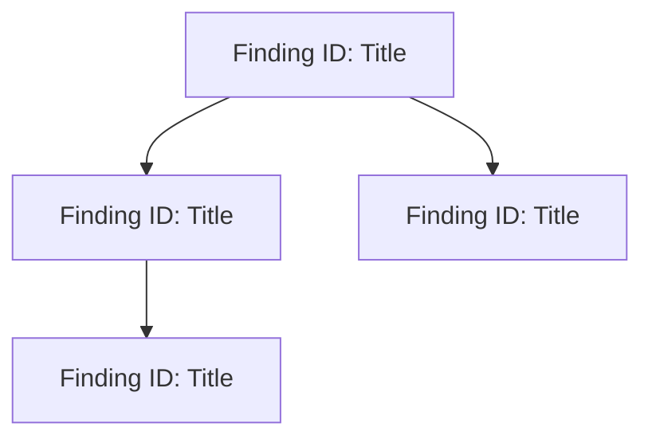

# Java Application Advisor — Remediation Backlog

> **Application**: [Application Name]
> **Generated**: [Date]
> **Based on**: [Findings Report path]
> **Total Items**: [N]

---

## Priority Matrix

|              | Low Effort (XS–S) | Medium Effort (M) | High Effort (L–XL)       |
| ------------ | ----------------- | ----------------- | ------------------------ |
| **Critical** | Fix immediately   | Fix immediately   | Plan + start this sprint |
| **High**     | Fix this sprint   | Fix this sprint   | Plan for next sprint     |
| **Medium**   | Next 2-3 sprints  | Next 2-3 sprints  | Backlog                  |
| **Low**      | Opportunistic     | Backlog           | Backlog                  |

---

## Batch 1: Immediate (Critical + High, Low Effort)

*Fix these first — high impact, quick wins.*

| #   | Finding ID | Title | Severity | Effort | Category | Dependencies |
| --- | ---------- | ----- | -------- | ------ | -------- | ------------ |
| 1   |            |       |          |        |          | None         |

### Detailed Remediation

#### Item 1: [Finding ID] — [Title]

**Problem**:
[Description of the issue]

**Location**: `[file path]`

**Current Code**:
```java
// Before — problematic code
```

**Fixed Code**:
```java
// After — corrected code
```

**Risk**: [What could go wrong if applied incorrectly]
**Verification**: [How to verify the fix — test to run, behavior to check]

---

## Batch 2: Short-term (High Remaining + Critical High-Effort)

*Plan these for the current or next sprint.*

| #   | Finding ID | Title | Severity | Effort | Category | Dependencies |
| --- | ---------- | ----- | -------- | ------ | -------- | ------------ |
| 1   |            |       |          |        |          |              |

### Detailed Remediation

#### Item 1: [Finding ID] — [Title]

**Problem**:
[Description of the issue]

**Location**: `[file path]`

**Current Code**:
```java
// Before — problematic code
```

**Fixed Code**:
```java
// After — corrected code
```

**Risk**: [What could go wrong if applied incorrectly]
**Verification**: [How to verify the fix]

---

## Batch 3: Medium-term (Medium Severity)

*Address over the next 2-3 sprints. Group related items for efficiency.*

| #   | Finding ID | Title | Severity | Effort | Category | Dependencies |
| --- | ---------- | ----- | -------- | ------ | -------- | ------------ |
| 1   |            |       |          |        |          |              |

### Detailed Remediation

#### Item 1: [Finding ID] — [Title]

**Problem**:
[Description of the issue]

**Location**: `[file path]`

**Current Code**:
```java
// Before — problematic code
```

**Fixed Code**:
```java
// After — corrected code
```

**Risk**: [What could go wrong if applied incorrectly]
**Verification**: [How to verify the fix]

---

## Batch 4: Ongoing (Low Severity)

*Address opportunistically — during related refactors, onboarding, or code reviews.*

| #   | Finding ID | Title | Severity | Effort | Category | Dependencies |
| --- | ---------- | ----- | -------- | ------ | -------- | ------------ |
| 1   |            |       |          |        |          |              |

### Detailed Remediation

[Brief remediation notes — these are low priority, so less detail is acceptable]

---

## Dependency Graph

*Some fixes must be applied in order. This graph shows prerequisites.*



---

## Effort Summary

| Batch                 | Items | Total Effort       | Recommended Timeline |
| --------------------- | ----- | ------------------ | -------------------- |
| Batch 1 (Immediate)   | 0     | 0 story points     | This sprint          |
| Batch 2 (Short-term)  | 0     | 0 story points     | Next sprint          |
| Batch 3 (Medium-term) | 0     | 0 story points     | Next 2-3 sprints     |
| Batch 4 (Ongoing)     | 0     | 0 story points     | Opportunistic        |
| **Total**             | **0** | **0 story points** |                      |

## Effort Sizing Guide

| T-Shirt Size | Story Points | Typical Scope                                                             |
| ------------ | ------------ | ------------------------------------------------------------------------- |
| XS           | 1            | Config change, annotation addition, single-line fix                       |
| S            | 2            | Single method refactor, add validation, add test                          |
| M            | 5            | Class-level refactor, new abstraction, multi-file change                  |
| L            | 8            | Cross-cutting refactor, new pattern adoption, module restructure          |
| XL           | 13+          | Architecture change, framework migration, large-scale pattern replacement |
