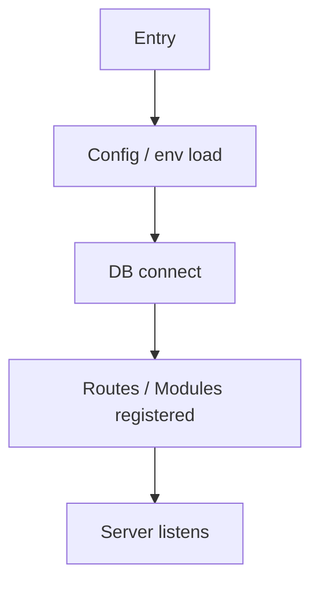
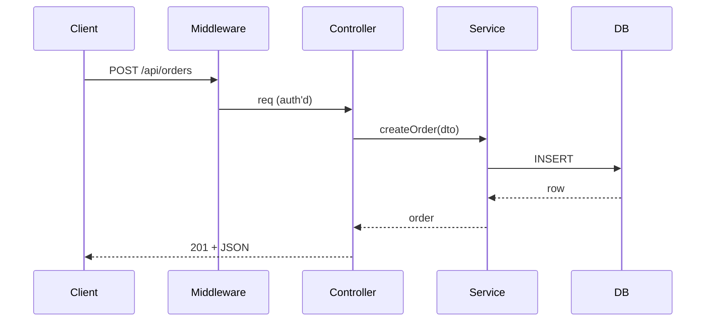

# Code Explanation Report: [Project Name]

**Date**: [Date]

## 1. Overview

[1–2 paragraphs: what the system does, who it serves.]

## 2. Tech Stack

| Category | Choice |
|---|---|
| Language | |
| Framework | |
| Runtime | |
| DB / ORM | |
| Validation | |
| Test runner | |
| Auth library | |

## 3. Project Structure

### Top-level layout

```
[paste the relevant tree — skip node_modules, dist, build]
```

### Monorepo packages (if applicable)

| Package | Path | Role |
|---|---|---|
| | | |

### Path aliases (from tsconfig)

| Alias | Resolves to |
|---|---|
| | |

## 4. Architecture

- **Pattern**: [Layered / Feature-based / Hexagonal / Modular (NestJS) / Other]
- **Entry point**: [file path]
- **Bootstrap sequence**:
  1.
  2.
  3.



## 5. Dependencies and Integrations

### External services called

| Service | Protocol | Library | Config Key |
|---|---|---|---|
| | | | |

### Internal dependencies (monorepo)

| Importer | Imports |
|---|---|
| | |

## 6. Configuration

- **Loader**: [dotenv / framework-native / config library]
- **Validation**: [Zod / envalid / none]
- **Env file profile order**: [.env, .env.local, .env.<NODE_ENV>, .env.<NODE_ENV>.local]
- **All env vars consumed** — see Build & Local Dev guide.

## 7. Request Flow (one representative)

[Endpoint: e.g., `POST /api/orders`]



Code path:

1. `[file:line]` — middleware
2. `[file:line]` — controller / route handler
3. `[file:line]` — service
4. `[file:line]` — repository / DB call
5. `[file:line]` — response

## 8. Data Models

| Name | Source of truth | Key fields |
|---|---|---|
| | | |

### Schema definition style

[Prisma `schema.prisma` / Drizzle TS schema / TypeORM `@Entity` / Mongoose `Schema` / Zod runtime schema]

### Relationships

[Brief diagram or list]

### Validation

- Library: [Zod / class-validator / Joi / Yup / AJV]
- Where applied: [middleware / pipe / inside handler]

## 9. Control Flow

### Middleware / hook stack

| Order | Middleware / Hook | Purpose |
|---|---|---|
| 1 | | |
| 2 | | |

### Error handling

- Global handler: [file:line]
- Custom error classes: [`HttpError`, `ValidationError`, ...]
- 500 fallback: [how it's logged + reported]

### Async patterns

- [async/await / Promise.all / streams / async iterators]

## 10. Design Patterns

| Pattern | Where used | Purpose |
|---|---|---|
| | | |

## 11. Type Discipline (TS projects)

- `strict`: [on/off]
- Escape hatches found: [`@ts-ignore` × N, `as any` × M]
- Notable: [discriminated unions, branded types, satisfies, conditional types]

## 12. Modern Node / TS features in use

| Feature | Where |
|---|---|
| | |

## 13. Testing

- **Framework(s)**: [Jest / Vitest / Mocha / node:test / Playwright (E2E)]
- **Commands**:
  | What | Command |
  |---|---|
  | Unit | |
  | Integration | |
  | Coverage | |
  | Single test | |
- **Coverage threshold**: [percentage or "not enforced"]
- **Mocking**: [Jest mocks / Vitest mocks / sinon / MSW]
- **Test naming convention**: [`*.test.ts` / `*.spec.ts` / `__tests__/`]
- **Fixtures / factories**: [factory.ts files / @faker-js/faker / fishery]

## 14. Notable Code Smells / Anti-Patterns (Deep mode)

-

## 15. Recommendations (Deep mode)

-
