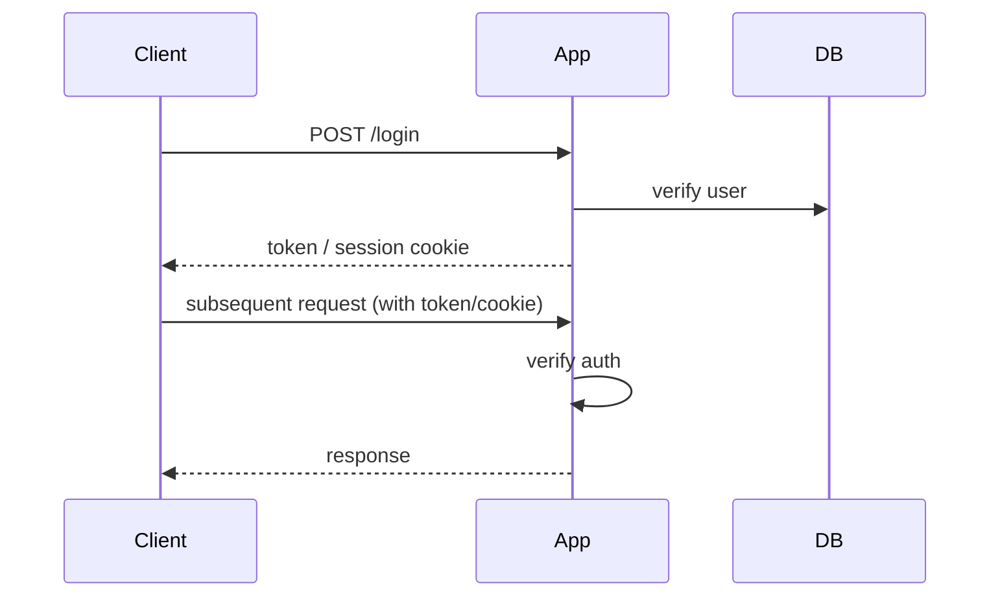

# Security Analysis Report: [Project Name]

**Date**: [Date]

## 1. Security Stack

| Topic | Tool / Library |
|---|---|
| Framework | |
| Auth library | |
| Session store | |
| JWT library | |
| Password hashing | |
| CORS | |
| Security headers | |
| Rate limiting | |
| CSRF | |
| Secrets source | |

## 2. Authentication

### 2.1 Mechanism

[Session-based / JWT / OAuth/OIDC / External IdP / API key / mTLS]

### 2.2 Flow



### 2.3 Token / Session details (whichever applies)

- **JWT signing alg**: [RS256 / HS256 / ES256]
- **Key source**: [env var / JWKS URI / local file]
- **Expiration**: [duration]
- **Refresh token**: [yes — how / no]

- **Session store**: [Redis / DB / encrypted cookie]
- **Cookie flags**: `httpOnly`, `secure`, `sameSite: [strict/lax/none]`

### 2.4 Password handling (if local users)

- Hashing: [bcrypt cost N / argon2 mem M / scrypt]
- Policy: [length / complexity rules]
- Reset flow: [token expiration, one-time use, ...]

## 3. Authorization

### 3.1 Route-level access matrix

| Path | Method | Access | Notes |
|---|---|---|---|
| | | | |

### 3.2 Programmatic / role-based checks

| Where | Check |
|---|---|
| | |

### 3.3 Role / permission model

- Roles: [list]
- Source of authority: [JWT claims / DB / external IdP]

## 4. Security Infrastructure

### 4.1 CORS

- Allowed origins: [literal list / regex / function]
- Allow credentials: [yes/no]

### 4.2 Security headers (helmet / equivalent)

| Header | Value |
|---|---|
| | |

### 4.3 Rate limiting

| Endpoint pattern | Limit | Store |
|---|---|---|
| | | |

### 4.4 CSRF

[N/A (Bearer auth) / Token (csurf / @fastify/csrf-protection) / SameSite cookie only]

### 4.5 Secrets management

| Secret env var | Source |
|---|---|
| | |

## 5. Security Testing

- Auth helpers / mocks: [file paths]
- Integration tests for 401/403: [test files]
- Dependency vulnerability scan: [npm audit / Snyk / Socket — and policy]

## 6. Local Development Authentication

```bash
# 1. Start the app:
[command]

# 2. Get a test token:
[command or steps]

# 3. Make a request:
curl -H 'Authorization: Bearer <token>' http://localhost:[port]/api/...
```

## 7. Anti-Patterns Found

| Pattern | Where | Severity |
|---|---|---|
| | | |

## 8. Recommendations (Deep mode)

-
